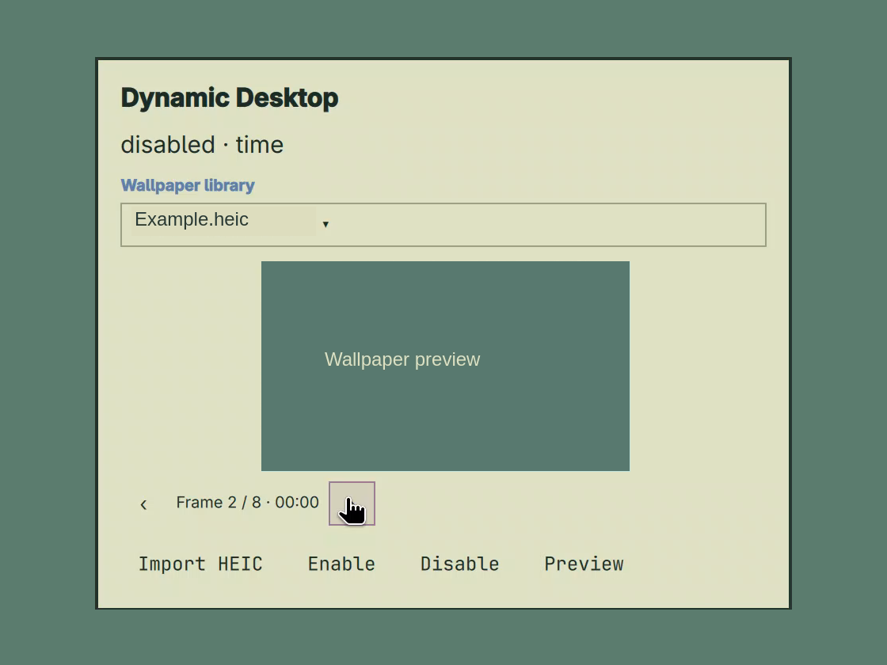

# Omarchy HEIC Dynamic Desktop

An Omarchy 4 bar plugin for original Apple HEIC/HEIF dynamic wallpapers. Uses
[timewall](https://github.com/bcyran/timewall) 2.1.0 as an external backend and
Omarchy's existing background renderer. No theme or compositor replacement.

Import several dynamic wallpapers, inspect individual frames in the compact bar
panel, or play a full-desktop day preview at two seconds per frame. Time-based,
solar and light/dark schedules are supported. Imported originals are copied into
a private library; the panel follows the system language with nine translations.



The screenshot is cropped from a real screen recording. The wallpaper image and
library filename have been replaced for publication; the surrounding controls
are the actual plugin UI. No third-party wallpaper artwork is distributed.

## Install on Omarchy

**One-time setup is required.** `omarchy plugin add` installs the bar panel;
timewall and the user service must also be prepared. The marketplace's **Manual
setup** label refers to this additional step. Tested on Omarchy 4.0.4 / Arch Linux
x86_64; newer Omarchy/OWE releases have not been validated.

### 1. Install the bar plugin

```sh
omarchy plugin add https://github.com/freedeaths/omarchy-heic.git --enable
cd ~/.config/omarchy/plugins/org.omarchy.heic
```

Confirm the Omarchy prompts and choose a bar position. The wallpaper icon opens
the panel. Installing the panel does not enable dynamic wallpaper playback.

### 2. Prepare dependencies and timewall

If you already have a compatible **timewall 2.1.0** on PATH, install the runtime
packages with `omarchy pkg add python python-gobject gtk3 libheif`, then continue
to step 3. Otherwise, the tested source-build path is:

```sh
omarchy pkg add python python-gobject gtk3 libheif git pkgconf clang rustup
rustup toolchain install stable
mkdir -p ~/Repos
git clone https://github.com/bcyran/timewall.git ~/Repos/timewall &&
git -C ~/Repos/timewall checkout --detach 19897aee9fee4f4ebd5cbd37b0fc4e3271cb6480 &&
python3 scripts/build-timewall.py --source ~/Repos/timewall --fast-png
```

Package installation may request your administrator password. If Rust/rustup is
already managed by another tool, use that existing stable rustup toolchain
instead of installing a conflicting Rust package. If `~/Repos/timewall` already
exists, use a separate clean checkout; the build helper requires the exact
upstream commit and refuses local modifications. The first Rust build downloads
dependencies and can take several minutes. See backend compatibility below for
the libheif 1.23.4 build rationale.

### 3. Set up the user service

For the backend built in step 2, run from the plugin checkout:

```sh
python3 install.py --shell-managed --backend .test-output/timewall-target/release/timewall
```

This installs the backend into `~/.local/bin`, the controller and a systemd user
service. It preserves the Omarchy-managed plugin/bar and needs no administrator
privileges. If a compatible timewall is already on PATH, click **Set up service**
in the panel instead, or run `python3 install.py --shell-managed`.

### 4. Import and enable a wallpaper

Open the wallpaper icon in the bar, click **Import HEIC**, and select one or more
HEIC/HEIF files you have permission to use. Files must contain Apple dynamic
wallpaper metadata; ordinary still HEIC images are rejected. After import:

- Select a wallpaper in the library dropdown.
- For a solar wallpaper, enter latitude/longitude; time wallpapers need no
  location, and light/dark wallpapers follow the Omarchy theme.
- Click **Enable** for automatic changes, or **Preview** to simulate a day on
  the desktop. Preview restores the previous wallpaper when it finishes.

Use the arrows for individual frame previews in the small image. Imported
originals are retained in `~/.local/share/omarchy-heic/library/`, so their source
files can be moved or deleted after a successful import.

If setup fails, check the panel message and run:

```sh
omarchy-heic status --json
journalctl --user -u omarchy-heic.service -n 50 --no-pager
```

The marketplace's verified snapshot covers the exact listed commit; the install
command clones current upstream code. Consult the listing's snapshot link if you
need to compare the installed commit with the reviewed version.

## Backend compatibility and standalone installation

Python 3.11+, GTK 3 and python-gobject (for the isolated multi-file chooser),
Omarchy 4.0.4, systemd user session, timewall 2.1.0 and a working
libheif decoder (timewall requires libheif >= 1.19.7). Current target: Arch Linux
x86_64. Newer Omarchy/OWE releases have not been validated.

Use a timewall build compatible with your installed libheif. The official 2.1.0
binary and a default source build failed decoding with libheif 1.23.4 in our tests:
its older fixed-size security-limit bindings copy the newer structure version.
For this target, build timewall with local header bindings and fast lossless PNG
encoding (requires Rust stable, pkg-config, clang and libheif headers):

```sh
git clone https://github.com/freedeaths/omarchy-heic.git ~/Repos/omarchy-heic
cd ~/Repos/omarchy-heic
git clone https://github.com/bcyran/timewall.git ~/Repos/timewall &&
git -C ~/Repos/timewall checkout --detach 19897aee9fee4f4ebd5cbd37b0fc4e3271cb6480 &&
python3 scripts/build-timewall.py --source ~/Repos/timewall --fast-png
OMARCHY_HEIC_TIMEWALL="$PWD/.test-output/timewall-target/release/timewall" python3 -m unittest discover -s tests -v
python3 install.py --backend .test-output/timewall-target/release/timewall
```

The build overlay enables libheif-sys bindgen and aliases two renamed enum labels
for libheif-rs 2.7. The recommended --fast-png option additionally uses fast lossless
PNG compression in the private build copy. It preserves image pixels and decoder
security limits, while producing somewhat larger PNG files. The upstream checkout
is untouched; omitting --fast-png leaves the Rust sources unchanged. Rebuild and rerun real backend tests after a libheif upgrade. If your
package-manager build already passes those tests, installation also supports:

```sh
python3 install.py                    # existing timewall on PATH
# Or install an already downloaded binary into ~/.local/bin:
python3 install.py --backend /path/to/timewall
```

The installer backs up shell.json, adds one bar widget, installs a user service
and theme hook, and starts the controller. Dynamic wallpaper is disabled until
you import a file and enable it. A repeat install preserves library/preferences.
No sudo is needed. The service starts only in a graphical Wayland session.

Click the wallpaper icon to import HEIC/HEIF, preview each frame, set a location
and enable it. Importing copies the original into the private library, so moving
the source file later is safe. Solar files require coordinates; import them from
darkman explicitly or enter them manually. Time files use local system time.
Appearance files follow the current Omarchy theme, independent of Portal/darkman.

## Commands

```sh
omarchy-heic import /absolute/path/to/wallpaper.heic
omarchy-heic location 33.59 130.40
omarchy-heic import-location          # opt-in: read darkman lat/lng
omarchy-heic enable
omarchy-heic status --json
omarchy-heic select <library-id>
omarchy-heic pause
omarchy-heic resume
omarchy-heic refresh
omarchy-heic disable
journalctl --user -u omarchy-heic.service
```

All monitors share the same wallpaper. Switching themes keeps the HEIC selected.
Choosing an ordinary wallpaper pauses automatic changes after a two-second
settling period. Pause leaves the current frame visible. Disable restores the
wallpaper that was visible before enabling only if the plugin still owns the
current background; otherwise the user's newer wallpaper is retained.

The controller checks ownership once per second and reevaluates the schedule
every 60 seconds. Theme transitions settle for two seconds before restoring the
dynamic image; choosing a wallpaper during that brief theme transition can be
treated as part of the transition. A same-theme refresh is detected through the
Omarchy theme lock and theme-set hook. Frame preview never changes the desktop.

HEIC without Apple dynamic metadata is rejected. Missing coordinates, invalid
metadata, decoding failures and damaged caches keep the last working image and
appear in the panel and journal; per-file batch failure details are in the
service journal and `status --json`. Automatic retries are limited to once per minute.
The source file remains in the library if a timewall cache is damaged; stop the
controller and remove only ~/.cache/omarchy-heic/timewall/wallpapers to rebuild it.

## Uninstall

```sh
python3 install.py --uninstall
```

Stops the service, removes only inventoried unmodified plugin files and its bar
entry, and retains library/preferences. Locally modified installed files are kept
and reported. Other themes, plugins and darkman settings are not removed.

## Development and verification

```sh
python3 -m unittest discover -s tests -v
OMARCHY_HEIC_TIMEWALL=/path/to/timewall python3 -m unittest discover -s tests -v
```

Real backend tests generate small original HEICs with time, solar and appearance
metadata using `heif-enc` and libheif. No Apple artwork is included. See
[architecture](docs/architecture.md) and [validation](docs/validation.md).

## Desktop day preview and languages (0.2)

The compact tray panel retains the small image and left/right frame controls.
A single **Preview** button plays today's actual sequence on the whole desktop
at two seconds per frame, and changes to **Stop preview** while running. The panel
has no overall scrolling; the library uses a dropdown and location controls appear
only for solar wallpapers. Custom dates and seconds per frame (0.5–10) remain
available through the CLI. Preparation runs in the background with progress. Playback duration
is the prepared sequence length × seconds per frame, including repeated frames
when the day returns to the same image. Adjacent identical selections are merged.
Time wallpapers use their nearest-marker schedule, as timewall does; solar
wallpapers ask timewall at each minute of the selected day at your coordinates.
Solar transitions shorter than a minute can be missed. Appearance files instead
preview their light/dark pair, because they have no day schedule.

Stop, completion, graceful service shutdown and restart recovery restore the
wallpaper and mode from before playback. Selecting another wallpaper cancels the
trial and retains your new choice. Theme changes interrupt playback and resume
normal theme handling. Changing the library selection or settings first stops and
restores a running trial. The real system clock is never changed.

```sh
omarchy-heic preview --seconds 2                   # today
omarchy-heic preview --seconds 1 --date 2026-10-09
omarchy-heic preview-stop
omarchy-heic import "first.heic" "second.HEIC"       # batch import
```

The chooser supports multiple files and filters to HEIC/HEIF extensions (including
upper case). Each selected file is validated for dynamic metadata; one failure
does not discard successful imports. The last successful file is selected.

Panel text lives in `plugin/i18n.json`, with English and Simplified Chinese
catalogs. `plugin/I18n.js` follows LC_ALL → LC_MESSAGES → LANG → Qt locale; Chinese
locales use the Simplified Chinese catalog and other locales fall back to English.
Placeholders must match across catalogs. Backend diagnostic details and filenames
are preserved, while known application errors and status messages are translated.
No language change is written to the user's system configuration. Run translation
helper checks with `node tests/i18n.test.cjs` (Node is only a test dependency).

The Import window supports Ctrl + click, Shift + click and Ctrl + A. Click a
file in the list before using Ctrl + A if a text field has focus. The chooser
runs as a separate GTK process with local files only; its stdout carries JSON
paths directly to the controller, without shell interpolation. Qt 6.11.2's
non-native Quick dialog does not implement multiple selection despite exposing
OpenFiles, so it is no longer used.

Imported originals live at
`~/.local/share/omarchy-heic/library/<sha256>/wallpaper.heic` (or the equivalent
XDG_DATA_HOME directory), alongside decoded PNGs and metadata. Configuration
is separate under `~/.config/omarchy-heic/`. Source files can be deleted safely
after import. Hover a library dropdown entry and click × to delete that library
copy, preserving the source file. Deleting the selected entry stops preview,
disables the schedule and restores the previous wallpaper if it is still owned
and available; external wallpapers are preserved. Other entries are unaffected.
Shared timewall decoding caches are retained. CLI: `omarchy-heic remove <id>`.

Frame labels include the metadata's time marker for time-based wallpapers, solar
altitude/azimuth for solar wallpapers, or light/dark for appearance wallpapers.
Time markers are reference points; timewall chooses the nearest marker rather
than treating each as the start of a time interval. Solar metadata does not
provide a fixed clock time independent of location and date.

## Standard Omarchy installation

The repository root has a standard manifest with `plugin/Panel.qml` as its entry
point. Install the shell plugin with:

```sh
omarchy plugin add https://github.com/freedeaths/omarchy-heic.git --enable
```

A compatible timewall 2.1.0, Python, GTK 3 and python-gobject are runtime
requirements. Omarchy's current plugin installer
clones/validates/enables plugins; it does not run service installation hooks or
install dependencies. Click **Set up service** in the panel once dependencies
are available. This runs `python3 install.py --shell-managed`, installing only
the runtime commands, service and theme hook. It preserves the git-managed
plugin and bar configuration. After a plugin update, the same button appears
when the running controller version differs; use it to update the runtime.

If you need to build the compatible backend after a standard plugin install,
work from `~/.config/omarchy/plugins/org.omarchy.heic`, use the pinned timewall
build command above, then run:

```sh
python3 install.py --shell-managed --backend .test-output/timewall-target/release/timewall
```

`install.py` handles installation and removal, not just uninstallation. The
original developer installation command still works. Standard Omarchy plugin
removal removes the shell component, so first run `python3 install.py --uninstall`
from the plugin checkout to stop/remove its runtime and restore an owned
wallpaper. The wallpaper library and preferences remain for later reuse.

## Import and preview performance (0.3)

The tray starts imports in the background and reports completed/total files.
The controller stays responsive and continues the existing wallpaper schedule
while decoding. Only one import is decoded at a time because timewall already
uses multiple encoder threads and large HEICs require substantial memory. The
completion summary clears after five seconds, does not reappear on polling or
shell restart, and full failure details remain in `status --json` and the journal.
CLI imports remain synchronous unless passed `--background`.

Duplicate imports hash the source and reuse the existing entry before invoking
the backend. Time/appearance scheduling and desktop previews directly reuse the
decoded library PNGs. Time selection matches timewall's circular nearest-marker
rule, including ties in metadata order. Solar selection still uses timewall; its
first day-plan preparation samples each minute and takes longer.

On this machine, a real 15-frame Tokyo Tower HEIC took 13.601 seconds to import
with the original PNG encoder and 5.531 seconds with fast PNG encoding. First
time-based preview preparation dropped from 16.197 seconds (a second decode) to
0.005 seconds. These are preparation/decoding measurements; rendering and the
configured playback interval are additional. Existing library copies are reused
and are not re-encoded.

The text catalog includes English, Simplified Chinese, Japanese, Korean, Spanish,
French, German, Portuguese and Russian. Locale precedence remains LC_ALL,
LC_MESSAGES, LANG, then Qt locale. Country variants select the base language
(e.g. pt_BR and pt_PT both use Portuguese); unsupported languages fall back to
English. Action buttons wrap within the panel for longer translated labels.

## License, third-party dependencies and wallpaper rights

This plugin is licensed under the [MIT License](LICENSE). Its license covers
the plugin's code and documentation, not imported wallpapers or third-party
dependencies.

- [timewall](https://github.com/bcyran/timewall) is an external backend. The
  pinned 2.1.0 source is MIT-licensed, copyright Bazyli Cyran. The optional build
  helper retains the upstream license in its private source copy; distributing
  timewall source or binaries requires retaining its copyright and license
  notice, along with the applicable dependency notices.
- [libheif](https://github.com/strukturag/libheif#license) is licensed under
  LGPL-3.0-or-later. Runtime dependencies are installed separately; this
  repository does not distribute timewall, libheif or codec binaries. Their
  licenses remain applicable, and any future bundled binary distribution must
  meet the licenses of the components it includes.
- No Apple wallpaper artwork or HEIC/HEIF wallpaper files are included. Import
  support does not grant rights to an image. Users must have the rights needed
  for their use of imported files; publishing or redistributing wallpapers or
  screenshots containing them may require separate permission.
  Wallpapers downloaded from [Dynamic Wallpaper Club](https://dynamicwallpaper.club)
  are subject to its [Terms of Service](https://dynamicwallpaper.club/tos):
  personal non-commercial use is allowed, qualifying fair-use reviews/articles/
  videos require attribution to the original author and DWC, and commercial use
  is prohibited. A download is not a blanket license to redistribute or promote
  a project using the artwork; the platform does not warrant non-infringement.
- HEIC commonly uses HEVC, which can be subject to patent licensing. Open-source
  copyright licenses do not establish that all necessary patent rights are
  available. Requirements depend on jurisdiction and use/distribution model;
  commercial distribution or bundling codecs requires separate assessment.

This is an independent community project and is not affiliated with, sponsored
by or endorsed by Apple Inc. Apple and macOS are trademarks of Apple Inc.
References to Apple technology describe compatibility only. Marketplace listing
does not constitute legal clearance or a security certification.
